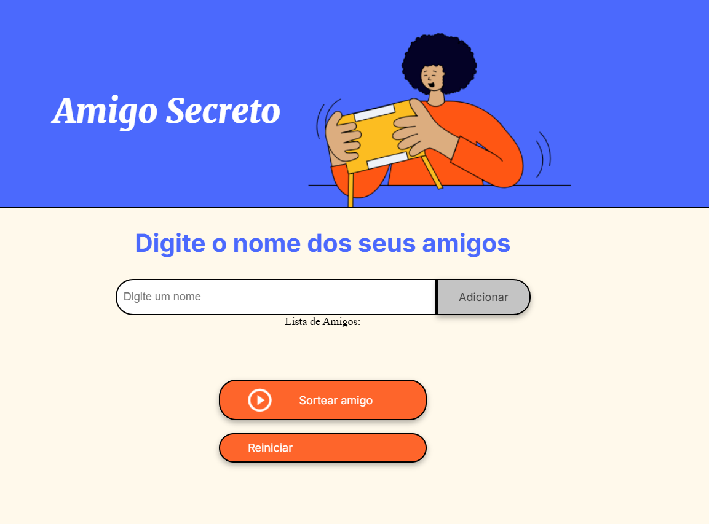
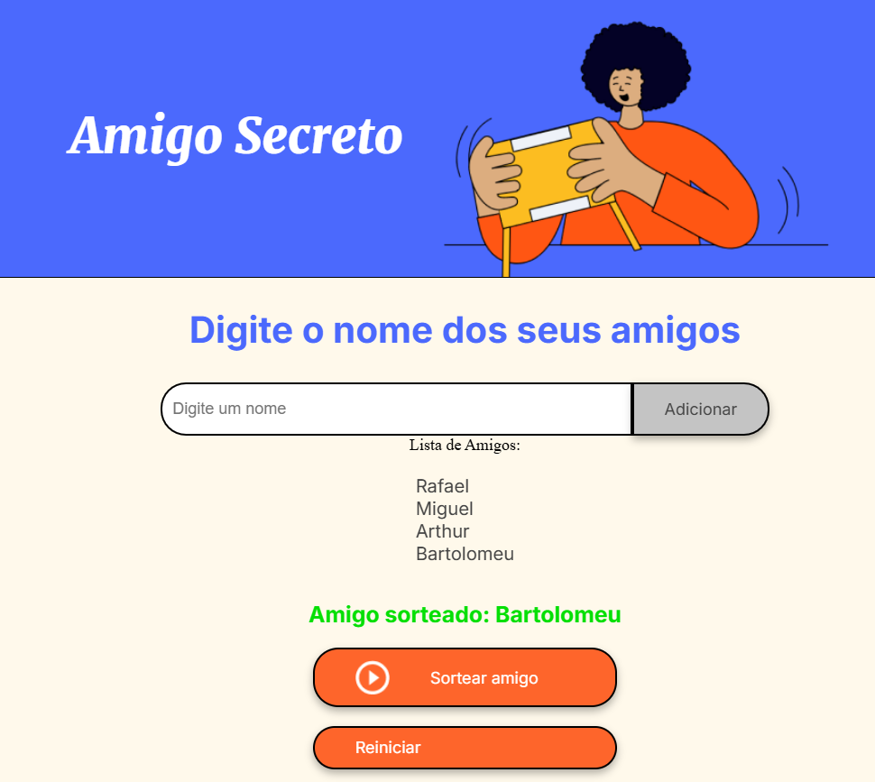

# Amigo Secreto

Este é um projeto simples de "Amigo Secreto" que permite adicionar nomes de amigos, listar os amigos adicionados e sortear um amigo secreto. O projeto é desenvolvido utilizando HTML, CSS e JavaScript.

## Funcionalidades

- **Adicionar Amigo**: Permite adicionar o nome de um amigo à lista.
- **Listar Amigos**: Exibe a lista de amigos adicionados.
- **Sortear Amigo**: Realiza o sorteio de um amigo secreto entre os nomes adicionados.
- **Reiniciar**: Reseta a lista de amigos e o resultado do sorteio.

## Capturas de Tela

### Tela Inicial

### Adicionando Amigos

### Sorteio de Amigo Secreto

## Como Usar

1. **Adicionar Amigo**: Digite o nome do amigo no campo de entrada e clique no botão "Adicionar".
2. **Listar Amigos**: Os amigos adicionados serão exibidos na lista abaixo do campo de entrada.
3. **Sortear Amigo**: Clique no botão "Sortear amigo" para realizar o sorteio. O nome do amigo sorteado será exibido abaixo da lista de amigos.
4. **Reiniciar**: Clique no botão "Reiniciar" para limpar a lista de amigos e o resultado do sorteio.

## Estrutura do Projeto

- `index.html`: Estrutura HTML da aplicação.
- `style.css`: Estilos CSS para a aplicação.
- `app.js`: Lógica JavaScript para adicionar, listar, sortear e resetar amigos.
- `assets`: Pasta contendo imagens e outros recursos.

## Executando o Projeto

Para executar o projeto, basta abrir o arquivo `index.html` em um navegador web.

## Contribuição

Sinta-se à vontade para contribuir com melhorias para este projeto. Para isso, faça um fork do repositório, crie uma branch para suas alterações e envie um pull request.